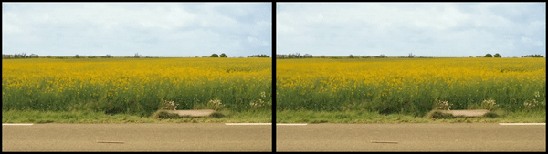

# The-Invisible-man

Removing a person from images using the technique of Image Segmentation.

the main code is in "The-Invisible-man.ipynb".
I will also add some sample images so that you guys can try things out right away.

In case you wish to learn more about image segmentation, i would like to recommend this blogpost

I really enjoyed reading it! It's really great.

- https://www.learnopencv.com/image-segmentation/

Here are some results i got

if you want to connect with me on Linkdin use this link here

- https://www.linkedin.com/in/rohan-saxena-2846a5163/
